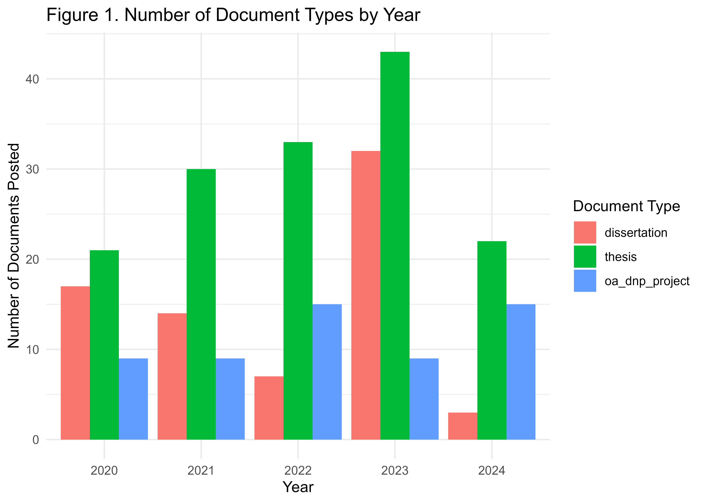
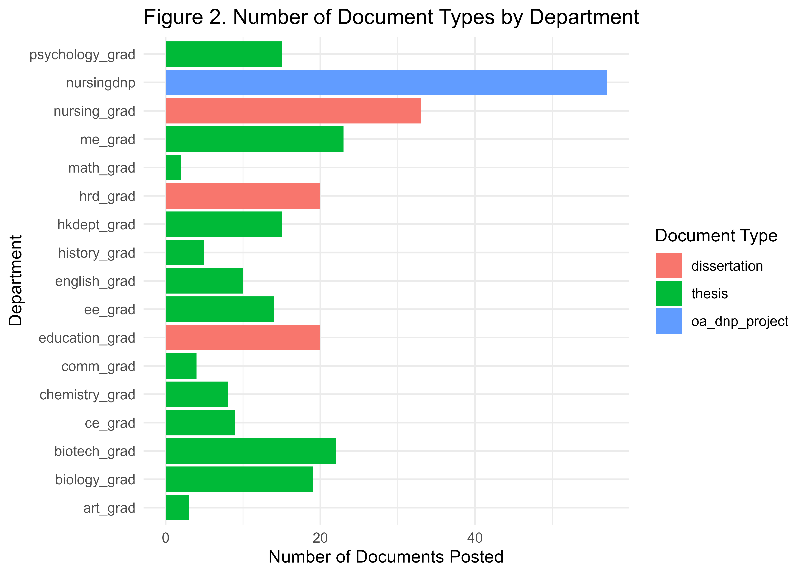

```{r setup, include=FALSE}
knitr::opts_chunk$set(echo = TRUE,
                      styler.colored = TRUE,
                      comment = NA,
                      warning = FALSE,
                      message = FALSE,
                      tidy = "styler",
                      error = FALSE, 
                      highlight = TRUE, 
                      prompt = FALSE,
                      cache = TRUE
                      )
```


```{r librarym, include=FALSE}
library(readxl)
library(dplyr)
library(ggplot2)
library(officer)
library(flextable)
library(lubridate)
library(gt)
library(webshot)
library(officer)
```

### A. Name of the Available Variables
```{r data, echo=FALSE}
# Define the file path
file_path <- "C:/Users/nghimire/OneDrive - University of Texas at Tyler/Desktop/r_catalog/all ETDs report.xlsx"

# Read the data
etd_data <- readxl::read_excel(file_path)
names(etd_data)
```

```{r checking_structure}
# Check the structure of the data
#str(etd_data)
```

```{r subset_data}
# Subset the data
etd_data_subset <- etd_data %>% 
  select(submission_date, date_posted, document_type, publication) %>%
  # change 'publication' to department
  rename(department = publication) 
summary(etd_data_subset)

# Inspect the first few rows of the date columns
head(etd_data_subset$submission_date)
head(etd_data_subset$date_posted)
```
  
```{r date_format}
# Extract the year from the date columns and convert document_type and department to factors
etd_data_subset <- etd_data_subset %>%
  mutate(submission_year = year(ymd_hms(submission_date)),
         posted_year = year(ymd_hms(date_posted)),
         document_type = as.factor(document_type),
         department = as.factor(department))

# Summarize the data to check the changes
summary(etd_data_subset %>% select(submission_year, posted_year, document_type, department))
```

```{r combine}
# Combine the document type
etd_data_subset <- etd_data_subset %>%
  mutate(document_type = recode(document_type, 
                                 'campus_dissertation' = 'dissertation',
                                 'campus_thesis' = 'thesis',
                                'restricted_dnp_project' = 'oa_dnp_project'))
etd_data_subset <- etd_data_subset %>% 
  select(submission_year, posted_year, department, document_type)


summary(etd_data_subset)
```

```{r calculation}
# Summarize the data
summary_table <- etd_data_subset %>%
  group_by(posted_year, department, document_type) %>%
  summarise(count = n(), .groups = 'drop') %>%
  arrange(posted_year, department, document_type)

# Create a pivot table for better visualization
pivot_table <- summary_table %>%
  pivot_wider(names_from = document_type, values_from = count, values_fill = list(count = 0))

# Display the summary table
print(pivot_table)
```

```{r plot}
# Plot the data
ggplot(summary_table, aes(x = posted_year, y = count, fill = document_type)) +
  geom_bar(stat = "identity", position = "dodge") +
  facet_wrap(~department) +
  labs(title = "Theses and Dissertations by Department",
       x = "Year",
       y = "Count",
       fill = "Document Type") +
  theme_minimal()
```

```{r document_type_year}
# Calculate document types by year
doc_types_by_year <- etd_data_subset %>%
  group_by(posted_year, document_type) %>%
  summarise(count = n(), .groups = 'drop')

# Print the data
print(doc_types_by_year)

# Create an enhanced fancy table using gt
fancy_table_year <- doc_types_by_year %>%
  gt() %>%
  tab_header(
    title = "Number of Document Types by Year"
  ) %>%
  cols_label(
    posted_year = "Year",
    document_type = "Document Type",
    count = "Count"
  ) %>%
  fmt_number(
    columns = vars(count),
    decimals = 0
  ) %>%
  data_color(
    columns = vars(count),
    colors = scales::col_numeric(
      palette = c("white", "lightblue", "blue"),
      domain = NULL
    )
  ) %>%
  tab_style(
    style = list(
      cell_fill(color = "lightgrey"),
      cell_text(weight = "bold")
    ),
    locations = cells_body(
      columns = everything(),
      rows = seq(1, nrow(doc_types_by_year), 2)
    )
  ) %>%
  tab_style(
    style = cell_borders(
      sides = "all",
      color = "black",
      weight = px(1)
    ),
    locations = cells_body(
      columns = everything(),
      rows = everything()
    )
  ) %>%
  cols_align(
    align = "center",
    columns = everything()
  )

# Save the enhanced gt table as an image
gtsave(fancy_table_year, "enhanced_doc_types_by_year.png")

# Plot document types by year (grouped)
document_types_by_year <- ggplot(doc_types_by_year, aes(x = as.factor(posted_year), y = count, fill = document_type)) +
  geom_bar(stat = "identity", position = position_dodge()) +
  labs(title = "Figure 1. Number of Document Types by Year",
       x = "Year",
       y = "Number of Documents Posted",
       fill = "Document Type") +
  theme_minimal()
# save the plot as a png file in the working directory (600 dpi)
#ggsave("document_types_by_year.png", document_types_by_year, dpi = 600)
```



```{r document_type_department}
# Calculate document types by department
doc_types_by_department <- etd_data_subset %>%
  group_by(department, document_type) %>%
  summarise(count = n(), .groups = 'drop')

# Create a fancy table using gt
fancy_table_department <- doc_types_by_department %>%
  gt() %>%
  tab_header(
    title = "Number of Document Types by Department"
  ) %>%
  cols_label(
    department = "Department",
    document_type = "Document Type",
    count = "Count"
  ) %>%
  fmt_number(
    columns = vars(count),
    decimals = 0
  ) %>%
  data_color(
    columns = vars(count),
    colors = scales::col_numeric(
      palette = c("white", "lightblue", "blue"),
      domain = NULL
    )
  )

# Save the gt table as an image
gtsave(fancy_table_department, "doc_types_by_department.png")
# Display the summary table for document types by department
print(doc_types_by_department)

# Plot document types by department (grouped) with flipped coordinates
document_types_by_department <- ggplot(doc_types_by_department, aes(x = department, y = count, fill = document_type)) +
  geom_bar(stat = "identity", position = position_dodge()) +
  labs(title = "Figure 2. Number of Document Types by Department",
       x = "Department",
       y = "Number of Documents Posted",
       fill = "Document Type") +
  theme_minimal() +
  coord_flip()
# save the plot as a png file in the working directory (600 dpi)
ggsave("document_types_by_department.png", document_types_by_department, dpi = 600)
```


